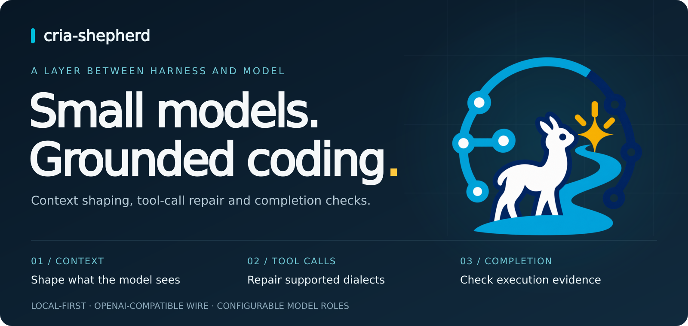
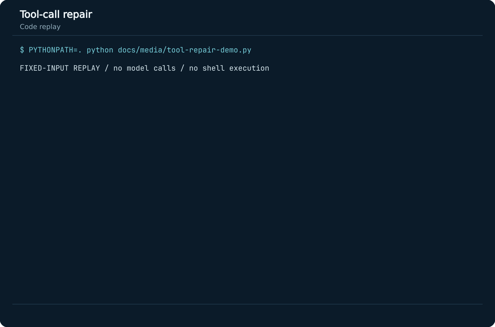
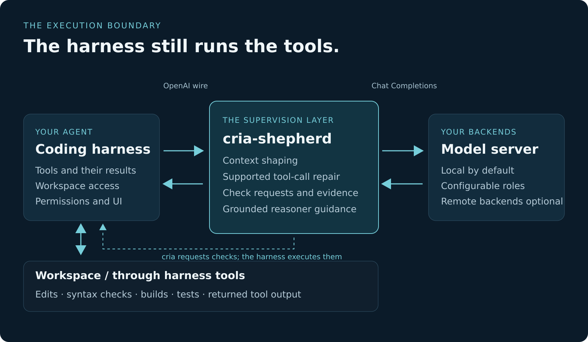
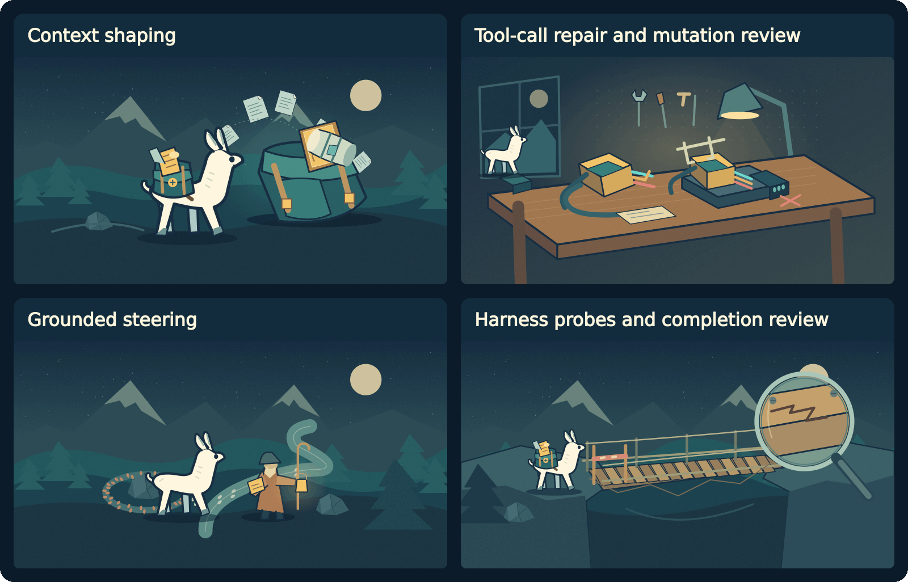
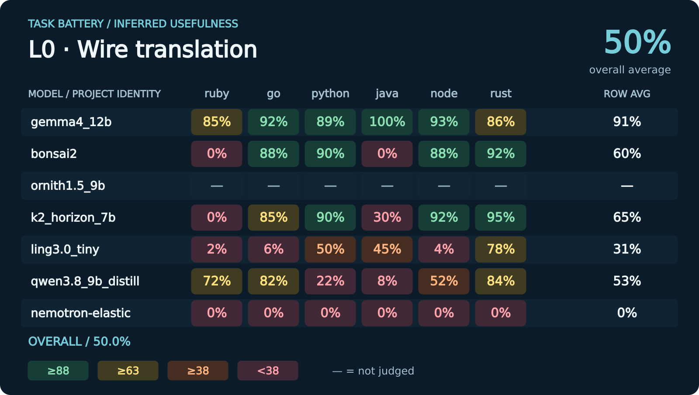
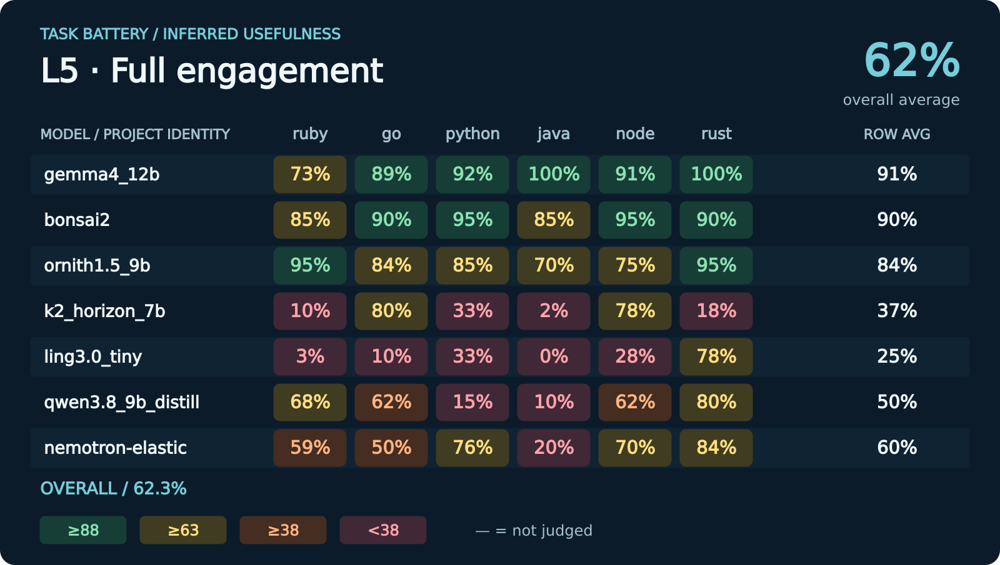

# cria-shepherd

cria-shepherd sits between a coding harness and its model server. It manages context, repairs supported tool-call formats, and requests checks when the agent reports completion.

The harness still runs commands, edits files and controls workspace permissions. cria works on the requests and responses passing between the harness and the model. It supports the OpenAI Chat Completions and Responses APIs, with local models as the default backend.

[Tool-call repair](#tool-call-repair) · [Assists](#what-cria-does) · [L0 vs L5](#l0-vs-l5) · [Getting started](#getting-started)

## Tool-call repair

A tool call can arrive as XML inside `reasoning_content` instead of a structured `tool_calls` entry. cria recovers supported formats and checks the arguments against the tool's schema.

This animation replays a fixed input through the recovery code. The `exec_command` call is recovered, and `yield_time_ms` is converted to an integer. Values that cannot be converted are left unchanged.



## How it fits



The classifier, coder, reasoner and compactor can share a model server or use separate backends. The optional planner is off by default.

## What cria does

Context shaping keeps the original task and current work in view as the conversation grows. Tool repair handles supported call formats, while mutation review checks proposed source changes. When a session gets stuck, cria gathers current workspace evidence for the reasoner. Completion review requests checks through the harness and uses the returned results.



## L0 vs L5

L0 handles wire translation only; L5 uses the full assist layer. The grids show inferred usefulness across six repository tasks, using the best retained L5 score for each model/task.





## Getting started

You need Python 3.11+, an OpenAI-compatible model server and a coding harness. PyYAML is installed with the package.

```bash
git clone https://github.com/papag00se/cria-shepherd.git
cd cria-shepherd
python3 -m venv .venv
. .venv/bin/activate
python -m pip install -e .
cp cria.example.toml cria.toml
```

Set `[defaults].base_url` and `[backends.local].base_url` in `cria.toml` to your model server, then start cria:

```bash
python -m cria --config ./cria.toml
```

The example uses a model server at `http://127.0.0.1:18084` and serves cria on port `18085`. Point your harness at `http://127.0.0.1:18085/v1`. For Codex, follow the [setup and context-window instructions](docs/codex-context-window.md).

### Logs and captures

```bash
cria-tail -f           # follow the event log
cria-tail --decisions  # show routing and engagement decisions
```

Enable `[logging].capture_calls = true` to record full calls. Captures include prompts, code and tool results, so check them for secrets before sharing.

### Tests

Run the tool-recovery, completion-gate and planning-policy tests:

```bash
python -m pip install pytest
python -m pytest -q tests/test_recovered_arg_types.py \
  tests/test_completion_gate_backstop.py tests/test_planning_is_opt_in.py
```

## Documentation

- [Configuration](cria.example.toml) and [model settings](docs/model-settings.md)
- [Design principles](docs/principles.md) and [assist implementation](docs/heuristic-assists.md)
- [Checks and completion review](docs/participation-evidence.md)
- [Logging and troubleshooting](docs/observability.md)
- [Task battery](docs/task-battery.md)
- [Research lineage and architecture](docs/shephard.md)

For contributions, start with [AGENTS.md](AGENTS.md).

A cria is a baby llama. The name comes from the original Shephard research prototype.
